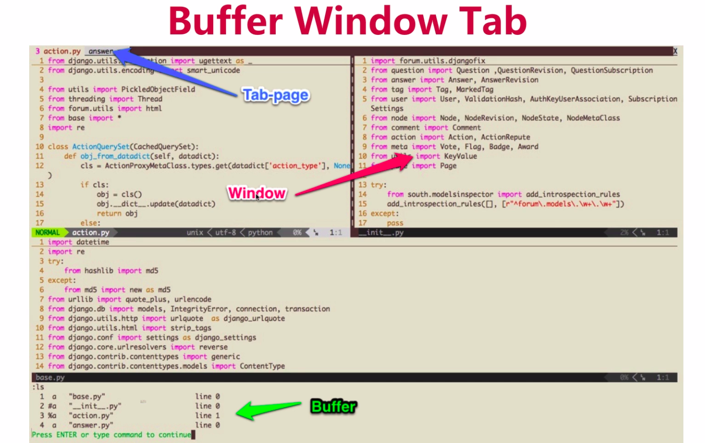
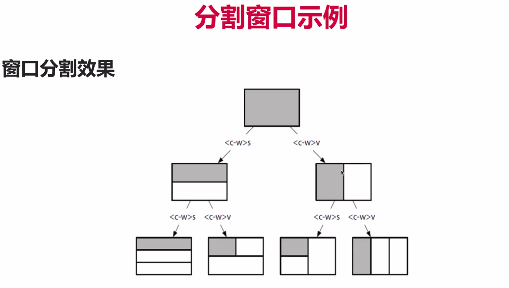

# 1 什么是Vim

## Linux 下量大编辑神器之一 Vim

- Linux/Unix下使用最多的编辑器
- Vi的改进版
- 可能是最难上手的编辑器之一

## 为什么要学习Vim

都21世纪了，为什么还要学习Vim

- 只要你使用服务器，Vim就是必备技能
- 后端和运维工程师必须掌握的编辑器，不然服务器上操作很尴尬
- 可以纯键盘编辑，提升编辑效率

## 痛点

Vim难上手，学习曲线陡峭

- Vim视频学习资料很少，网上很多博客讲解零散，不够直观
- 缺少系统的教程。Vim命令众多，难以学习和记忆
- Vim学习曲线比较陡，需要较长时间才能上手，劝退很多初学者

## 课程目的

帮你驯服Vim

- 了解和掌握Vim中的基本概念
- 熟悉Vim基本使用方法，能够做到日常编辑(纯键盘编辑)
- 知道如何自定义Vim，安装插件无线扩充Vim的功能

## 课程内容

如何学习Vim? Vim经常被诟病难以上手和使用

- Vim的概念和基本操作，比如移动和增删改查
- 如何配置Vim，编写自己的vimrc文件
- 如何安装和使用插件，无限扩充Vim功能

## 受众

哪些人可以从本门课程收益？

- 运维工程师/后端工程师等
- Linux用户
- 对Vim感兴趣，想要提升开发效率的开发者甚至普通用户

## 预备知识

不要去掌握Vim的基础知识，但最好使用Linux/Unix系统

- 熟悉基本的命令行操作(一般Vim多在Linux服务器上使用)
- 知道如何安装Vim
- 有其他编辑器的使用经验。几乎所有流行IDE和编辑器都有Vim扩展

## 课程特色

学会Vim非一日之功，得靠肌肉记忆

- 由浅入深，循序渐进。从基本的概念和操作讲起
- 授人以鱼，同时授人以渔。学会了插件自己扩充Vim功能
- 大量实践技巧(所有演示均使用按键回显工具，让你看得更明白)

# 2 初识Vim

## 2.1 下载与安装

作为开发者的你，安装Vim应该很简单

- Linux/Unix(mac)自带Vim，直接终端里输入Vim即可进入
- Windows用户可以下载Gvim等安装和体验
- 建议Windows用户可以尝试使用虚拟机来体验Linux下的Vim

## 2.2 Vim模式

- normal模式
- 编辑模式：i/a/o I/A/O. i - insert ; a - append ; o - open a line below
- 命令模式
- 可视化模式

### 2.2.1 Vim 和其他很多编辑器的区别在于多种模式

- 进入vim默认是normal(普通)模式?为什么不是编辑模式呢
- 使用a(append) i (insert)等进入编辑模式
- 还有:cmd命令模式和v(isual)可视化模式

进入vim默认是normal模式，使用Esc从插入回到普通模式。普通模式下可以进行各种命令操作和移动。大部分情况下是在浏览而不是编辑，所以vim默认是normal模式。

### 2.2.2 INSERT模式

- 使用a i o 进入插入模式
- 使用Esc退出插入模式到normal模式
- A I O是如何进入插入模式的

### 2.2.3 Command(命令)模式

Normal模式下输入:后执行命令，如保存退出 :wq

- 顾名思义，执行vim命令，比如保存:w ,退出:q 
- 比如分屏:vs(vertical split) , :sp(split)
- 比如使用:%s/foo/bar/g全局替换

### 2.2.4 Visual(可视)模式

Visual模式一般用来块状选择文本

- Normal模式下使用v进入visual选择
- 使用V选择行
- 使用ctrl + v进行方块选择

## 2.3 Vim插入模式小技巧

- 进入vim之后首先使用a/i/o之一进入插入模式
- ctrl + h 删除上一个字符；ctrl + w删除上一个单词; ctrl + u删除当前行

快速切换insert和normal模式：

很多键盘的键位设置，ESC按起来不方便，不方便切换到normal

- 使用Ctrl + c代替Esc(但可能会中断某些插件)或 Ctrl + [
- gi 快速跳到你最后一次编辑的地方并进入插入模式
- 在配置章节讲解如何映射方便的快捷键来代替Esc

## 2.4 vim 快速移动大法

反人类的hjkl

### 2.4.1 在单词间飞舞

在单词之间移动是我们浏览操作中最常用的命令

- w/W移动到下一个word/WORD开头。e/E下一个word/WORD尾
- b/B回到上一个word/WORD开头，可以理解为backword
- word 指的是以非空白符分割的单词， WORD以空白符分割的单词

行间搜索移动，同一行快速移动的方式其实是搜索一个字符并且移动到该字符

- 使用f{char}可以移动到char字符上，t移动到char的前一个字符
- 如果第一次没搜到，可以使用分号(;)/逗号(,)继续搜该行下一个/上一个
- 大写的F表示反过来搜前面的字符

### 2.4.2 vim水平移动

如何快速移动到一行的行首或行尾呢？

- 0 移动到行首第一个字符，^移动到第一个非空白字符
- $移动到行尾，  g_ 移动到行尾非空白字符
- 记住常用的0和$就可满足日常需求了

### 2.4.3 vim垂直移动

还以在句子(sentence)和段落(paragraph)间移动(不常用)

- 使用括号( )在句子间移动，可以使用:help (来查看帮助
- 使用{ }在段落之间移动
- 插件章节会将如何用easy-motion插件移动，这些命令就不用记忆了

### 2.4.4 vim页面移动

翻页命令太多，2/8定律，记住常见的就能满足需求

- gg/G移动到文件开头和结尾，使用ctrl+o快速返回
- H/M/L跳转到屏幕的开头Head,中间Middle和结尾Lower
- ctrl + u.  ctrl+f.上下翻页.(upword/forward)。zz把屏幕置为中间

## 2.5 vim 增删改查

### 2.5.1 vim快速删除

如何快速删除一个字符或单词呢？

- 在normal模式下使用x删除一个字符
- 使用d(delete)配合文本对象快速删除一个单词daw(d around word) : diw/daw/dt)-删到)位置，不含)/d$/d0
- d和x都可以搭配数字来执行多次: 2dd/4x
- 数字+命令表示多次执行命令

### 2.5.2 vim 快速修改

相比删除，更常用修改，一般是删除后改成我们期望的文本

- 常用有三个: r(replace) , c (change), s(substitute) R/C/S

- normal模式下使用r可以替换一个字符。s替换并进入插入模式

- 使用c配合文本对象，可以快速进行修改：ct)-替换到)位置

### 2.5.3 vim查询

查询单词也是一个常用操作

- 使用/或?进行前向或反向搜索
- 使用n/N跳转到下一个或上一个匹配
- 使用*或#进行当前单词的前向和后向匹配

## 2.6 vim如何搜索替换

### 2.6.1 vim替换命令

substitute命令运行我们查找并替换文本，并且支持正则

- :[range]s[ubstitute]/{pattern}/{string}/[flags]
- range表示范围， 比如: 10, 20表示10-20行, % 表示全部
- pattern是要替换的模式, string 是替换后文本

替换标志位，Flags 有几个常用的标志

- g(global)表示全局范围执行
- c(confirm)表示确认，可以确认或拒绝修改
- n(number)报告匹配到的次数而不替换，可以用来查询匹配次数：:1,6 s/self//n

:% s/\\<quack\\>/jiao/g 将quack替换成jiao, 但是do_quack不会替换，<>是精确匹配

## 2.7 vim多文件操作

### 2.7.1 概念 

- Buffer: 是指打开的一个文件的内存缓冲区
- Window：是Buffer可视化的分割区域
- Tab：可以组织窗口为一个工作区

示例如下图：

### 2.7.2 Buffer

什么是缓冲区？

- vim 打开一个文件后会加载文件内容到缓冲区
- 之后的修改都是针对内存中的缓冲区，并不会直接保存到文件
- 直到我们执行:w(write)的时候才会把修改内容写入到文件里

buffer切换，那如何在buffer之间切换呢？

- 使用:ls 会列举当前缓冲区，然后使用:b n跳转到第n个缓冲区
- :bpre :bnext :bfirst :blast 分别跳转到previous , next , first , last缓冲区
- 或者使用:b buffer_name 加上tab补全来跳转

在vim的normal模式下，使用:e file_name打开file_name的文件

### 2.7.3 Window 窗口

窗口是可视化的分割区域

- 一个缓冲区可以分割成多个窗口，每个窗口也可以打开不同缓冲区
- <Ctrl+w>s水平分割, <Ctrl+w>v垂直分割。或:sp和:vs
- 每个窗口可以继续被无限分割(看屏幕是否够大)

窗口分割示例如下图所示：

如何切换窗口

**窗口切换的命令都是使用Ctrl+w(windon)作为前缀**

<C-w>w		在窗口键循环切换

<C-w>h\H		切换到左边的窗口

<C-w>j/J		切换到下边的窗口

<C-w>k/K		切换到上边的窗口

<C-w>h/H		切换到右边的窗口

大写的命令是移动窗口，而不是移动光标

如何重拍窗口？

重排窗口可改变窗口的大小:h window-resize查看文档

<C-w>=		使所有窗口等宽、等高

<C-w>_		最大化活动窗口的高度

<C-w>|		最大化活动窗口的宽度

[N]<C-w>_	把活动窗口的高度设为[N]行

[N]<C-w>|	把活动窗口的宽度设为[N]列

### 2.7.4 Tab(标签页)将窗口分组

Tab是可以容纳一系列窗口的容器(:h tabpage)

- vim的Tab和其他编辑器不太一样，可以想象成Linux的虚拟桌面
- 比如一个Tab全用来编辑Python文件，一个Tab全是HTML文件
- 相比窗口，Tab一般用个的比较少，Tab太多管理起来比较麻烦

Tab(标签页)操作

Tab使用不多，简单了解一下常用操作就好

:tabe[dit]  {filename}		在新标签页中打开{filename}

<C-w>T					把当前窗口移到一个新标签页

:tabc[lose]  		   	关闭当前标签页及其中的所有窗口

:tabo[nly]	    只保留活动标签页，关闭所有其他标签页

Tab(标签页)切换操作

如何切换不同的标签页，一般建立两个就好，太多不好操作

| Ex命令          | 普通模式命令 | 用途                    |
| --------------- | ------------ | ----------------------- |
| :tabn[ext] {N}  | {N}gt        | 切换到编号为{N}的标签页 |
| :tabn[ext]      | gt           | q切换到下一标签页       |
| :tabp[reviouse] | gT           | q切换到上一标签页       |

