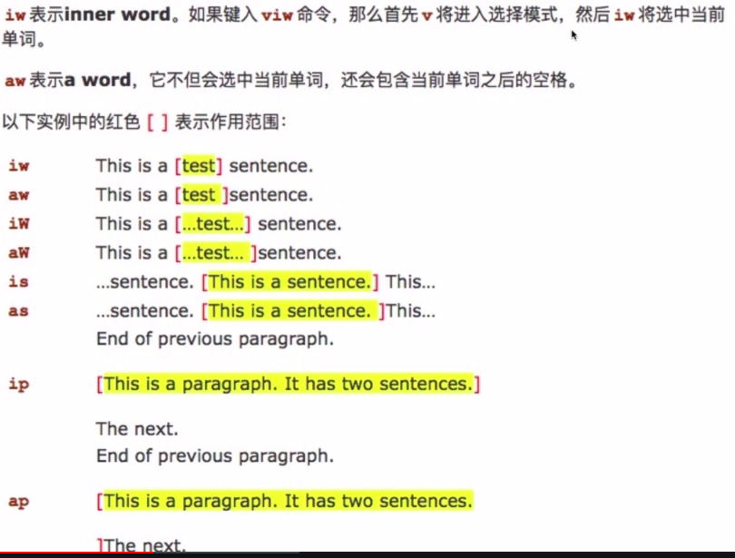
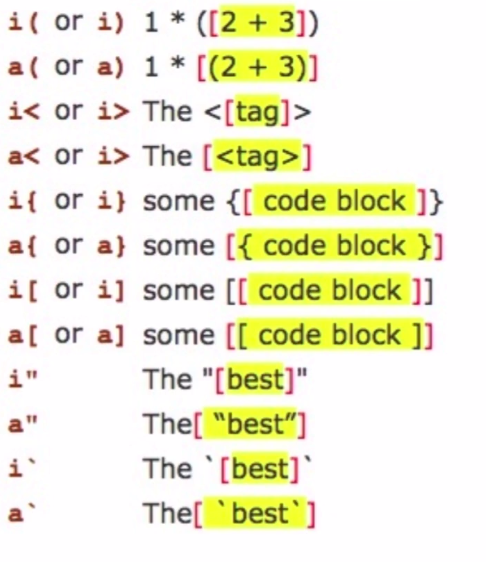

# 1 什么是Vim

## Linux 下量大编辑神器之一 Vim

- Linux/Unix下使用最多的编辑器
- Vi的改进版
- 可能是最难上手的编辑器之一

## 为什么要学习Vim

都21世纪了，为什么还要学习Vim

- 只要你使用服务器，Vim就是必备技能
- 后端和运维工程师必须掌握的编辑器，不然服务器上操作很尴尬
- 可以纯键盘编辑，提升编辑效率

## 痛点

Vim难上手，学习曲线陡峭

- Vim视频学习资料很少，网上很多博客讲解零散，不够直观
- 缺少系统的教程。Vim命令众多，难以学习和记忆
- Vim学习曲线比较陡，需要较长时间才能上手，劝退很多初学者

## 课程目的

帮你驯服Vim

- 了解和掌握Vim中的基本概念
- 熟悉Vim基本使用方法，能够做到日常编辑(纯键盘编辑)
- 知道如何自定义Vim，安装插件无线扩充Vim的功能

## 课程内容

如何学习Vim? Vim经常被诟病难以上手和使用

- Vim的概念和基本操作，比如移动和增删改查
- 如何配置Vim，编写自己的vimrc文件
- 如何安装和使用插件，无限扩充Vim功能

## 受众

哪些人可以从本门课程收益？

- 运维工程师/后端工程师等
- Linux用户
- 对Vim感兴趣，想要提升开发效率的开发者甚至普通用户

## 预备知识

不要去掌握Vim的基础知识，但最好使用Linux/Unix系统

- 熟悉基本的命令行操作(一般Vim多在Linux服务器上使用)
- 知道如何安装Vim
- 有其他编辑器的使用经验。几乎所有流行IDE和编辑器都有Vim扩展

## 课程特色

学会Vim非一日之功，得靠肌肉记忆

- 由浅入深，循序渐进。从基本的概念和操作讲起
- 授人以鱼，同时授人以渔。学会了插件自己扩充Vim功能
- 大量实践技巧(所有演示均使用按键回显工具，让你看得更明白)

# 2 初识Vim

## 2.1 下载与安装

作为开发者的你，安装Vim应该很简单

- Linux/Unix(mac)自带Vim，直接终端里输入Vim即可进入
- Windows用户可以下载Gvim等安装和体验
- 建议Windows用户可以尝试使用虚拟机来体验Linux下的Vim

## 2.2 Vim模式

- normal模式
- 编辑模式：i/a/o I/A/O. i - insert ; a - append ; o - open a line below
- 命令模式
- 可视化模式

### 2.2.1 Vim 和其他很多编辑器的区别在于多种模式

- 进入vim默认是normal(普通)模式?为什么不是编辑模式呢
- 使用a(append) i (insert)等进入编辑模式
- 还有:cmd命令模式和v(isual)可视化模式

进入vim默认是normal模式，使用Esc从插入回到普通模式。普通模式下可以进行各种命令操作和移动。大部分情况下是在浏览而不是编辑，所以vim默认是normal模式。

### 2.2.2 INSERT模式

- 使用a i o 进入插入模式
- 使用Esc退出插入模式到normal模式
- A I O是如何进入插入模式的

### 2.2.3 Command(命令)模式

Normal模式下输入:后执行命令，如保存退出 :wq

- 顾名思义，执行vim命令，比如保存:w ,退出:q 
- 比如分屏:vs(vertical split) , :sp(split)
- 比如使用:%s/foo/bar/g全局替换

### 2.2.4 Visual(可视)模式

Visual模式一般用来块状选择文本

- Normal模式下使用v进入visual选择
- 使用V选择行
- 使用ctrl + v进行方块选择

## 2.3 Vim插入模式小技巧

- 进入vim之后首先使用a/i/o之一进入插入模式
- ctrl + h 删除上一个字符；ctrl + w删除上一个单词; ctrl + u删除当前行

快速切换insert和normal模式：

很多键盘的键位设置，ESC按起来不方便，不方便切换到normal

- 使用Ctrl + c代替Esc(但可能会中断某些插件)或 Ctrl + [
- gi 快速跳到你最后一次编辑的地方并进入插入模式
- 在配置章节讲解如何映射方便的快捷键来代替Esc

## 2.4 vim 快速移动大法

反人类的hjkl

### 2.4.1 在单词间飞舞

在单词之间移动是我们浏览操作中最常用的命令

- w/W移动到下一个word/WORD开头。e/E下一个word/WORD尾
- b/B回到上一个word/WORD开头，可以理解为backword
- word 指的是以非空白符分割的单词， WORD以空白符分割的单词

行间搜索移动，同一行快速移动的方式其实是搜索一个字符并且移动到该字符

- 使用f{char}可以移动到char字符上，t移动到char的前一个字符
- 如果第一次没搜到，可以使用分号(;)/逗号(,)继续搜该行下一个/上一个
- 大写的F表示反过来搜前面的字符

### 2.4.2 vim水平移动

如何快速移动到一行的行首或行尾呢？

- 0 移动到行首第一个字符，^移动到第一个非空白字符
- $移动到行尾，  g_ 移动到行尾非空白字符
- 记住常用的0和$就可满足日常需求了

### 2.4.3 vim垂直移动

还以在句子(sentence)和段落(paragraph)间移动(不常用)

- 使用括号( )在句子间移动，可以使用:help (来查看帮助
- 使用{ }在段落之间移动
- 插件章节会将如何用easy-motion插件移动，这些命令就不用记忆了

### 2.4.4 vim页面移动

翻页命令太多，2/8定律，记住常见的就能满足需求

- gg/G移动到文件开头和结尾，使用ctrl+o快速返回
- H/M/L跳转到屏幕的开头Head,中间Middle和结尾Lower
- ctrl + u.  ctrl+f.上下翻页.(upword/forward)。zz把屏幕置为中间

## 2.5 vim 增删改查

### 2.5.1 vim快速删除

如何快速删除一个字符或单词呢？

- 在normal模式下使用x删除一个字符
- 使用d(delete)配合文本对象快速删除一个单词daw(d around word) : diw/daw/dt)-删到)位置，不含)/d$/d0
- d和x都可以搭配数字来执行多次: 2dd/4x
- 数字+命令表示多次执行命令

### 2.5.2 vim 快速修改

相比删除，更常用修改，一般是删除后改成我们期望的文本

- 常用有三个: r(replace) , c (change), s(substitute) R/C/S

- normal模式下使用r可以替换一个字符。s替换并进入插入模式

- 使用c配合文本对象，可以快速进行修改：ct)-替换到)位置

### 2.5.3 vim查询

查询单词也是一个常用操作

- 使用/或?进行前向或反向搜索
- 使用n/N跳转到下一个或上一个匹配
- 使用*或#进行当前单词的前向和后向匹配

## 2.6 vim如何搜索替换

### 2.6.1 vim替换命令

substitute命令运行我们查找并替换文本，并且支持正则

- :[range]s[ubstitute]/{pattern}/{string}/[flags]
- range表示范围， 比如: 10, 20表示10-20行, % 表示全部
- pattern是要替换的模式, string 是替换后文本

替换标志位，Flags 有几个常用的标志

- g(global)表示全局范围执行
- c(confirm)表示确认，可以确认或拒绝修改
- n(number)报告匹配到的次数而不替换，可以用来查询匹配次数：:1,6 s/self//n

:% s/\\<quack\\>/jiao/g 将quack替换成jiao, 但是do_quack不会替换，<>是精确匹配

## 2.7 vim多文件操作

### 2.7.1 概念 

- Buffer: 是指打开的一个文件的内存缓冲区
- Window：是Buffer可视化的分割区域
- Tab：可以组织窗口为一个工作区

示例如下图：


### 2.7.2 Buffer

什么是缓冲区？

- vim 打开一个文件后会加载文件内容到缓冲区
- 之后的修改都是针对内存中的缓冲区，并不会直接保存到文件
- 直到我们执行:w(write)的时候才会把修改内容写入到文件里

buffer切换，那如何在buffer之间切换呢？

- 使用:ls 会列举当前缓冲区，然后使用:b n跳转到第n个缓冲区
- :bpre :bnext :bfirst :blast 分别跳转到previous , next , first , last缓冲区
- 或者使用:b buffer_name 加上tab补全来跳转

在vim的normal模式下，使用:e file_name打开file_name的文件

### 2.7.3 Window 窗口

窗口是可视化的分割区域

- 一个缓冲区可以分割成多个窗口，每个窗口也可以打开不同缓冲区
- <Ctrl+w>s水平分割, <Ctrl+w>v垂直分割。或:sp和:vs
- 每个窗口可以继续被无限分割(看屏幕是否够大)

窗口分割示例如下图所示：


如何切换窗口

**窗口切换的命令都是使用Ctrl+w(windon)作为前缀**

<C-w>w		在窗口键循环切换

<C-w>h\H		切换到左边的窗口

<C-w>j/J		切换到下边的窗口

<C-w>k/K		切换到上边的窗口

<C-w>h/H		切换到右边的窗口

大写的命令是移动窗口，而不是移动光标

如何重拍窗口？

重排窗口可改变窗口的大小:h window-resize查看文档

<C-w>=		使所有窗口等宽、等高

<C-w>_		最大化活动窗口的高度

<C-w>|		最大化活动窗口的宽度

[N]<C-w>_	把活动窗口的高度设为[N]行

[N]<C-w>|	把活动窗口的宽度设为[N]列

### 2.7.4 Tab(标签页)将窗口分组

Tab是可以容纳一系列窗口的容器(:h tabpage)

- vim的Tab和其他编辑器不太一样，可以想象成Linux的虚拟桌面
- 比如一个Tab全用来编辑Python文件，一个Tab全是HTML文件
- 相比窗口，Tab一般用个的比较少，Tab太多管理起来比较麻烦

Tab(标签页)操作

Tab使用不多，简单了解一下常用操作就好

:tabe[dit]  {filename}		在新标签页中打开{filename}

<C-w>T					把当前窗口移到一个新标签页

:tabc[lose]  		   	关闭当前标签页及其中的所有窗口

:tabo[nly]	    只保留活动标签页，关闭所有其他标签页

Tab(标签页)切换操作

如何切换不同的标签页，一般建立两个就好，太多不好操作

| Ex命令          | 普通模式命令 | 用途                    |
| --------------- | ------------ | ----------------------- |
| :tabn[ext] {N}  | {N}gt        | 切换到编号为{N}的标签页 |
| :tabn[ext]      | gt           | q切换到下一标签页       |
| :tabp[reviouse] | gT           | q切换到上一标签页       |

## 2.8 vim的text object

text object:文本对象

vim里文本也有对象的概念，比如一个单词，一段句子，一个段落

很多其他编辑器经常只能操作单个字符来修改文本，比较低效

通过操作文本对象来修改要比只操作单个字符高效

### 2.8.1 文本对象的操作方式

之前已经使用过文本对象了，如dw 删除一个单词

- [number]\<command>[text object]
- number表示次数，command是命令，d(elete), c(hange),y(ank)
- text object 是要操作的文本对象，比如单词w,句子s,段落p

示例如下图：






i----inner, a---around

viw--

vaw--

caw--

vi"--选中双引号中的内容

ci"--删除双引号中的内容并进入插入模式

ci{

ci(

**延伸：有些插件扩展了文本对象，比如vim-go可以使用f表示一个函数**

## 2.9 vim复制粘贴与寄存器的使用

### 2.9.1 vim normal 模式复制粘贴

- normal模式下复制粘贴分别使用y(yank)和p(put)，剪贴d和p
- 我们可以使用v(visual)命令选中所要复制的地方，使用y进行复制，然后使用p粘贴
- 配合文本对象：比如使用yiw复制一个单词，yy复制一行
- vim里的剪贴(cut)复制(copy)粘贴(paste)分别是delete/yank/put

### 2.9.2 Insert 模式下的复制粘贴

此模式下，大多数人会使用鼠标进行选中，然后使用ctrl+v或cmd+v粘贴

-  这个和其他的文本编辑器差不多，但是粘贴代码有个坑
- 很多人在vimrc中设置了autoindent，粘贴Python代码缩进错乱
- 这个时候需要使用:set paste和:set nopaste解决。先设置:set paste，然后进入插入模式，再使用ctrl+v或cmd+v

### 2.9.3 vim的寄存器

什么是vim寄存器？vim在normal模式下复制剪贴的内容去哪里了？

- vim里操作的是寄存器而不是系统剪贴板，这和其他编辑器不同
- 默认我们使用d删除或y复制的内容放到了"无名寄存器"
- 用x删除一个字符放到无名寄存器，然后p粘贴，可以调换俩字符

深入寄存器(register)

**vim不使用单一剪贴板进行剪贴、复制与粘贴，而多组寄存器**

- 通过"{register}前缀可以指定寄存器，不指定默认用无名寄存器
- 比如使用"ayiw复制一个单词但寄存器a中，"bdd删除当前行到寄存器b中 
- vim中 ""表示无名寄存器，缺省使用。""  p其实就等同p

其他寄存器

**除了有名寄存器a-z，vim中还有一些其他常见寄存器**

- 复制专用寄存器 "0 使用y复制文本同时会被拷到复制寄存器0
- 系统剪贴板 "+ 可以在复制前加上 "+复制到系统剪贴板
- :set clipborad=unnamed可以让你直接复制粘贴系统剪贴板内容

:set clipborad=unnamed ---> 选择文本(可在visual模式下进行)-->y--->其他地方，ctrl+v

- q其他一些寄存器比如 "%当前文件名 ,  ".上次插入的文本

## 2.10 vim 如何用宏完成强大的批量操作

强大的Vim宏(macro)

从需求说起：给多行url链接加上双引号，你会怎么做？

```
https://www.zhihu.com/question/54919485
https://www.zhihu.com/topic
https://www.zhihu.com/topic/19601308
https://www.zhihu.com/explore
```

### 什么是vim宏

- 宏可以看成是一系列命令的集合
- 我们可以使用宏"录制"一系列操作，然后用于"回放"
- 宏可以非常方便地把一系列命令用在多行文本上

### 如何使用宏

宏的使用分为录制和回放

- 在normal模式下，使用q来录制，同时也是q结束录制
- 使用q{register}选择要保存的寄存器，把录制的命令保存其中。比如qa将录制的内容放到a寄存器里
- 使用@{register}回放寄存器中保存的一系列命令

### 用宏解决刚才的问题

- 先给一行加上双引号，然后在回放到其他所有行
- 我们先使用q开始录制，给一行加上双引号，之后使用q退出
- 在剩下的所有行回放录制的宏

操作流程：

vim打开文件(当前处于normal) -- > qa -->正常操作，给第一行加上双引号

-- > esc，返回到normal -- > q 结束录制 -- > j 移到下一行 -- > V选中当前行，G一直选中到文件末尾 -- > 输入冒号 :  -- > 输入normal -- > 输入空格

-- > 输入 @a -- > 完成给所有行加上双引号

### 另一实现方法

vim打开文件(当前处于normal) -- > V , G选中所有 -- > 输入冒号 :  -- > 输入normal -- > 输入空格 -- > I" --- > 回车 --- > 输入冒号 : , 然后Ctrl + p(重复上一次命令) --- > 退格键删除 I" --- > 输入 A" ---> 完成修改

## 2.11 vim 补全大法

### 什么是补全

- 补全是根据当前环境上下文编辑器"猜"你想输入的东西
- 比如补全一个单词、文件名，或者代码中的函数名、变量名等
- vim中提供了多种补全功能，还可以有插件拓展功能实现补全代码

### vim中常见的补全

vim中有多种补全方式：

| 命令         | 补全类型         |
| ------------ | ---------------- |
| \<C-n>       | 普通关键字       |
| \<C-x>\<C-n> | 当前缓冲区关键字 |
| \<C-x>\<C-i> | 包含文件关键字   |
| \<C-x>\<C-]> | 标签文件关键字   |
| \<C-x>\<C-k> | 字典查找         |
| \<C-x>\<C-l> | 整行补全         |
| \<C-x>\<C-f> | 文件名补全       |
| \<C-x>\<C-o> | 全能(Omni)补全   |

C-n表示ctrl+n

### 常见的三种补全类型

- 使用ctrl+n 和 ctrl+p补全单词
- 使用ctrl+x ctrl+f补全文件名
- 使用ctrl+x ctrl+o补全代码，需要开启文件类型检查(syntax on)，安装插件

全能补全：filetype on--> set filetype=python


### 如何输入当前文件的文件名

google: vim input current path

只插入文件名  :r! echo %

包含路径的文件名 :r! echo %:p

more info:

:help read

:help filename-modifiers

## 2.12 给vim换个配色

很多现代化的编辑器和IDE都支持更换主题，vim当然也可以，一般是通过配色方案的设置实现

- 使用 :colorscheme显示当前的主题配色，默认是default
- 使用 :colorscheme <ctrl+d> 可以显示所有的配色
- 有中意的配色后，用 :colorscheme 配色名 就可以修改配色

### 从网上下载配色

默认的配色没有喜欢的怎么办？

- 从网络上寻找更好看的配色：搜索vim colorscheme  如vim-hybird
- https://github.com/flazz/vim-colorschemes
- 安装之后就有大量的主题可以更换了

在尝试更改vim配色方案后，想要持久化配置需要写到vimrc中

可以下载多个配色方案到.vim/colors并且随时更换

## 2.13 裸vim也很强

裸vim: 本章没有使用配置过的vim而是用裸vim演示


# 3 编写vim 配置

## 3.1 编写vim配置

### 什么是vim配置

vim里非常多常用的设置，比如:set number设置行号，简写形式为 :set nu, **在normal模式下，使用 :h option-list查看所有的简写**。之前的使用都是在vim里临时设置，没办法持久化，每次设置很烦。vimrc提供了一种持久化配置的方式，让我们自定义配置。

### 如何编写vim配置文件

Linux/Unix下新建一个隐藏文件vim ~/.vimrc

windows系统 vim $MYVIMRC , 通过环境变量编辑配置文件

然后就可以在里面编写自定义配置了

### vim配置都包含什么

- 常用设置，如 :set nu设置行号， colorscheme hybrid设置主题
- 常见的vim映射，如 noremap  \<leader>w :w<cr> 保存文件
- 自定义的vimscript函数(vim高手)和插件的配置(插件篇会讲)

常用设置：

- 我们可以把常用的设置写到 .vimrc里避免每次打开vim重新设置
- 比如设置行号 :set nu ; 设置主题 :colorscheme hybird
- vim里有非常多这种配置，可能需要参考别的配置

### vim中的映射

vim中的映射比较复杂，源于vim有多种模式

- 设置一下leader键 let mapleader="," 常用的是逗号或空格
- 比如用inoremap \<leader>w \<Esc>:w\<cr> 在插入模式保存

注：inoremap, i---> insert 模式, nore---> no recursive，map--->映射

配置文件的生效：1，退出vim,再次进入 2,输入 :source ~/.vimrc(vimrc的路径)

### vim插件

现代化的vi可以通过插件管理器安装插件

- 通过插件你可以无限扩充vim的功能
- 想要使用插件需要具备一定的vim配置知识

### vim脚本

vim有自己的脚本语言vimscript. vim 脚本对于vim高级 玩家来说可以实现强大的vim插件。初学者知道有这个概念就好，vim脚本是一种简单的脚本语言。可以通过vimscript实现更多vim的控制，开发自己的插件

**TIPS**

可以将vimrc文件放到github上，这样多台电脑就可以同步配置了

### 练习

- 尝试建立一个.vimrc文件，加入常见的设置选项看看效果
- 研究一下github上vim-go教程vim-go-tutorial的vimrc文件

下面是一个示例：

```bash
" 常用设置
" 设置行号
set number
colorscheme hybrid
" 按F2进入粘贴模式
set pastetoggle=<F2>
" 高亮搜索
set hlsearch
" 设置折叠方式
set foldmethod=indent

" 一些方便的映射
let mapleader=','
let g:mapleader=','

" 使用 jj 进入 normal模式。 `^是特殊字符是上次编辑模式停留的位置
inoremap jj <Esc>`^
" 使用leader+w 直接保存
inoremap <leader>w <Esc>:w<cr>
noremap <leader>w :w<cr>

" 切换buffer
nnoremap <silent> [b :bprevious<CR>
nnoremap <silent> [n :bnext<CR>
" user ctrl+h/j/k/l switch window
noremap <C-h> <C-w>h
noremap <C-j> <C-w>j
noremap <C-k> <C-w>k
noremap <C-l> <C-w>l
" Sudo to write 
cnoremap w!! w !sudo tee % >/dev/null
" json格式化
com! FormatJSON %!python3 -m json.tool

" 插件设置，这里使用了 vim-plug
call plug#begin('~/.vim/plugged')

" 安装差价只需把 github地址放到这里重启后执行 :PlugInstall就好了
Plug 'mhinz/vim-startify'
Plug 'scrooloose/nerdtree'

call plug#end()

" 插件相关配置
" 禁止startify自动切换目录
let g:startify_change_to_dir = 0

" nerdtree
nmap ,v :NERDTreeFind<cr>
nmap ,g :NERDTreeToggle<cr>

" 定义函数SetTitle, 自动插入文件头
func SetTile()
	if &filetype == 'python'
		call setline(1, "\#!/usr/bin/env python")
		call setline(2, "\#_*_ coding:utf-8 _*_")
		normal G
		normal o
		normal o
		call setline(5, "if __name__ == '__main__':")
		call setline(6, "	pass")
	endif
endfunc
"
```

**将某一行放到窗口的最顶端**

先移动到这一行，然后使用zt即可

## 3.2 vim映射

### 什么是vim映射

vim映射就是把"一个操作"映射到"另一个操作"。如果你不满限制的按键设置？比如vim本来的命令

或者你想映射一些方便的快捷键，按照你的医院定制vim。即：当我按下某些键时，放弃你默认的操作，按我的想法去做。

### 基本映射

基本映射指的是normal模式下的映射，当然还有其他模式的映射。

- 使用map就可以实现映射。比如 :map - x然后按 - 就会删除字符(之前是x删除字符)
- :map \<space> viw告诉vim按下空格的时候选中整个单词
- :map \<c-d> dd 可以使用ctrl+d执行dd删除一行
- 使用 :unmap - 就会取消-映射为x的配置

### 其他模式映射

vim常用模式normal/visual/insert都可以定义映射

- 用nmap/vmap/imap定义映射只在normal/visual/insert分别有效
- 比如在visual模式下选中一个单词，将选中的单词改成大写。:vmap \ U把在visual模式下选中的文本大小(u/U转换大小写)
- 如何在insert模式下映射ctrl+d来删除一行。:imap \<c-d> \<Esc>ddi 因为dd是normal模式的命令，因此不能直接映射为dd

### 现有映射的问题

比如存在如下的映射配置，那vim是如何工作的呢：

:nmap - dd

:nmap \ -

当按下\时，vim会解释为-。我们有映射了- ! vim会机械解析-为dd，即删除整行。(是不是有点类似与递归)

### 递归与非递归映射

之前使用的*map系列命令有递归的风险。如果你安装了一个插件，插件映射了同一个按键的不同行为，有冲突就会有一个失效。想要保证插件映射没有冲突，解决方案就是使用非递归映射。

### 非递归映射

vim提供了非递归映射，这些命令不会递归解释

- 使用*map对应的nnoremap/vnoremap/inoremap
- 何时使用递归映射(\*map)，何时使用非递归映射(*nnoremap). 任何时候都应该使用非递归映射。

### 练习

- 尝试在你的vimrc中定义一些映射，提升你的工作效率
- 参考下一些开源的vim配置，看看哪些映射可以拿来用
- 阅读免费网络小书《笨方法学Vimscript》中关于映射的章节，这是一本学习vim脚本的非常易懂的小书

## 3.3 本章总结

# 4 vim插件

## 4.1 vim插件安装

### 什么是插件

和其他现代流行编辑器一样，vim同样支持强大的插件扩展。vim插件是使用vimscript或其他脚本语言编写的vim功能扩展。编辑器自带的功能有限，有了插件之后几乎可以无限制扩充其功能。网络上比如github.com等有很多开源的vim插件可以使用。

### 如何安装插件

原始的方式是直接clone插件代码，如今vim有很多插件管理器。目前vim有很多插件管理器可供选择，你可以选择一个顺手的。常见的有vim-plug , Vundle, Pathogen, Dein.Vim volt等。从综合性能、易用性、文档等几个方面，这里推荐使用vim-plug。

### 使用vim-plug 安装插件

这里使用vim-plug安装我们的第一个插件。先要安装vim-plug本身，github: 

https://github.com/junegunn/vim-plug

学习一个新东西最好的方式就是看官方文档示例，按照官方的教程，我们就可以非常容易地了解它的使用方式.

install:

```bash
curl -fLo ~/.vim/autoload/plug.vim --create-dirs \
    https://raw.githubusercontent.com/junegunn/vim-plug/master/plug.vim
```

usage:

Add a vim-plug section to your `~/.vimrc` (or `~/.config/nvim/init.vim` for Neovim):

1. Begin the section with `call plug#begin()`
2. List the plugins with `Plug` commands
3. call plug#end() to update &runtimepath and initialize plugin system
   - Automatically executes `filetype plugin indent on` and `syntax enable`. You can revert the settings after the call. e.g. `filetype indent off`, `syntax off`, etc.

**Example**

```bash
" Specify a directory for plugins
" - For Neovim: ~/.local/share/nvim/plugged
" - Avoid using standard Vim directory names like 'plugin'
call plug#begin('~/.vim/plugged')

" Make sure you use single quotes

" Shorthand notation; fetches https://github.com/junegunn/vim-easy-align
Plug 'junegunn/vim-easy-align'

" Any valid git URL is allowed
Plug 'https://github.com/junegunn/vim-github-dashboard.git'

" Multiple Plug commands can be written in a single line using | separators
Plug 'SirVer/ultisnips' | Plug 'honza/vim-snippets'

" On-demand loading
Plug 'scrooloose/nerdtree', { 'on':  'NERDTreeToggle' }
Plug 'tpope/vim-fireplace', { 'for': 'clojure' }

" Using a non-master branch
Plug 'rdnetto/YCM-Generator', { 'branch': 'stable' }

" Using a tagged release; wildcard allowed (requires git 1.9.2 or above)
Plug 'fatih/vim-go', { 'tag': '*' }

" Plugin options
Plug 'nsf/gocode', { 'tag': 'v.20150303', 'rtp': 'vim' }

" Plugin outside ~/.vim/plugged with post-update hook
Plug 'junegunn/fzf', { 'dir': '~/.fzf', 'do': './install --all' }

" Unmanaged plugin (manually installed and updated)
Plug '~/my-prototype-plugin'

" Initialize plugin system
call plug#end()
```


### 安装你的第一个插件

安装vim-startify ， 一个好用的vim开屏插件

1. 编辑~/.vimrc , 在正确的位置添加`Plug 'mhinz/vim-startify'`
2. normal模式输入 :source ~/.vimrc 回车
3. normal模式下输入 :PlugInstall 回车

:qa 退出所有窗口

#### 

## 4.2 如何寻找需要的插件

先有需求，后有插件。大部分插件托管在了github上

- 通过google搜索关键词寻找想要的插件，如搜索vim file manager plugin. 如nerdtree进行目录文件管理， python-mode , vim-go
- 在vimawesome.com上找
- 浏览网上开源的vim配置借鉴想要的插件

## 4.3 Vim美化插件

更改vim外观的插件：

- 修改启动界面: https://gitub.com/mhinz/vim-startify
- 状态栏美化: https://github.com/vim-airline/vim-airline
- 增加代码缩进线条: https://github.com/yggdroot/indentline

vim配色方案

找到一个你喜欢的配色

- vim-hybrid配色: github.com/w0ng/vim-hybrid
- solarized配色: github.com/altercation/vim-colors-solarized
- gruvbox配色: github.com/morhetz/gruvbox

## 4.4 vim文件目录和搜索插件，跳转文件

操作目录，搜索，跳转文件

**文件目录**

默认的文件目录管理比较简陋，nerdtree弥补了这个问题

文件管理器nerdtree---使用nerdtree插件进行文件目录数管理

- https://github.com/scrooloose/nerdtree

- autocmd vimenter * NERDTree 可以在启动vim的时候打开
- nnoremap \<leader>v :NERDTreeFind\<cr>查找文件位置

normal模式下的启用方式，输入 :NERDTree 回车

也可以采用映射方式， 详细配置见文档

ctrl + wp切换到当前窗口, ctrl + f

**快速搜索文件**

如果想快速根据文件名查找打开一个文件呢？

模糊搜索器，如果想快速查找并打开一个文件可以用ctrlp插件

- https://github.com/ctrlpvim/ctrlp.vim
- let g:ctrlp_map = '\<c-p>'
- 使用ctrl+p然后开始输入少量字符就可以搜索啦

## 4.5 vim快速定位插件

快速跳转到当前文件的任意一个位置

vim移动命令：

- 比如w/e基于单词移动，gg/G文件首位，0/$行首尾，f{char}查询字符
- ctrl + f ctrl + u前后翻屏
- 那假如我想快速跳到当前窗口显示区的任意位置呢？需要用插件帮助实现

**如何移动到任意位置**

可以使用vim 的搜索/加上n跳转，但是使用easymotion更方便

- https://github.com/easymotion/vim-easymotion
- 官方文档比较长，很多人没有看懂怎么用，其实一个映射就能应付
- nmap ss \<Plug>(easymotion-s2)

:vs ~/.vimrc

## 4.6成对编辑插件vim-surround

如果快速让你更换一对单引号为双引号，你会怎么做？

一个一个查找然后替换，是不是比较低效呢？

https://github.com/tpope/vim-surround

**vim-surround使用**

normal模式下增加，删除，修改成对内容

- ds (delete a surrounding) ds "删除双引号
- cs (change a surrounding) cs " ' 双引号变单引号 cs ( ] 圆括号变为方括号
- ys (you add a surrounding)   ys iw " 给一个单词加双引号

## 4.7 Vim模糊搜索和批量替换插件

我们经常需要在一个代码项目中模糊搜索一些文本，怎么办呢？

- Vim自带的搜索/可以搜索当前文件，但是项目文件有很多个文件
- 需要一个插件来模糊搜索多个文件内容
- 使用Ag.vim或fzf.vim都可以很好滴支持模糊搜索

**fzf与fzf.vim**

fzf是一个强大的命令行模糊搜索工具，fzf.vim集成到了vim里

https:/github.com/junegunn/fzf.vim

使用Ag [PATTERN]模糊搜索字符串 使用ctrl h/j/k/l进行移动

使用Files [PATH]模糊搜索目录

**搜索替换插件far.vim**

如果想要批量搜索替换，可以试试far.vim

https://github.com/brooth/far.vim

比如在重构代码的时候经常会用到

使用方式 :Far foo bar **/*.py

## 4.8 golang 之vim-go

编辑器 VS IDE

IDE一代又一代，经典的编辑器却长久不衰

除了Java， 很多人用vim编写shell/php/golang/python/ruby

前端很多人使用vscode , sublime/Atom有没落之势

很多后端和运维工程师使用vim，微信后台和阿里飞天系统很多代码出自在服务器上使用vim的工程师

**vim-go**

功能强大的golang插件vim-go

- https://github.com/fatih/vim-go
- 写代码时需要的主要功能：代码补全，重构，跳转，自动格式化，自动导入等
- vim-go基本可以满足golang的日常开发

ctrl xo o i ]

格式化：:GoFmt

光标停在"url"上重构： :GoRename 回车----> newurl，最后url换成了newurl

自动导入： :GoImports

运行： :GoRun

## 4.9 python-mode

python-mode把vim打造成轻量Python IDE

Python插件使用比较多的是jedi-vim(代码补全)和python-mode(除补全外还有很多其他的功能)

https://github.com/python-mode/python-mode

python-mode同样具备基本的补全、跳转、重构、格式化功能，即使是在服务器上也能愉快调试Python代码

**安装要求**

vim >= 7.3

vim编译是支持python or python3

--with-feature=big if you want `g:pymode_lint_signs`

**安装**

vim-plug方式

```bash
Plug 'python-mode/python-mode', { 'for': 'python', 'branch': 'develop' }
```

需要等待子模块的git clone完成

下面是关于python-mode的一些设置：

```bash
" python-mode
let g:pymode_python = 'python3'
let g:pymode_trim_whitespaces = 1
let g:pymode_doc = 1
let g:pymode_doc_bind = 'K'
let g:pymode_rope_goto_definition_bind = "<C-]>"
let g:pymode_lint = 1
let g:pymode_lint_checkers = ['pyflask', 'pep8', 'mccabe', 'pylint']
let g:pymode_options_max_line_length = 120
```

ctrl+xo补全，ctrl+n选择

ctrl+cro 按PEP8的要求整理导入包的顺序

:PymodeLintAuto 按PEP8整理代码格式

## 4.10 vim tagbar

vim tagbar, 更愉快地浏览代码

**tagbar**

代码大纲，vim当然也有，而且支持非常多编程语言

github主页： https://github.com/majutsushi/tagbar

**依赖**

universal-ctags


